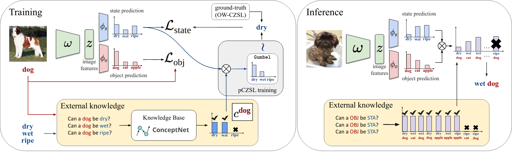

# Knowledge Guided Simple Primitives
This is the  PyTorch code our CVPR 2022 work [KG-SP: Knowledge Guided Simple Primitives
for Open World Compositional Zero-Shot Learning](https://arxiv.org/pdf/2205.06784.pdf) .  The code provides the implementation of our proposed method KG-SP, along with the baselines of CompCos and CGE  taken from [here](https://github.com/ExplainableML/czsl). Additionally, we also provide the splits for our pCZSL setting on 3 datasets (UT-Zappos, MIT-States and C-GQA). 

<p align="center">
  
</p>

## Setup 

1. Clone the repo 

2. We recommend using Anaconda for environment setup. To create the environment and activate it, please run:
```
    conda env create --file environment.yml
    conda activate czsl
```

4. Go to the cloned repo and open a terminal. Download the datasets and embeddings, specifying the desired path (e.g. `DATA_ROOT` in the example):
```
    bash ./utils/download_data.sh DATA_ROOT
    mkdir logs
```

## Training
**Open World.** To train a model, the command is simply:
```
    python train.py --config CONFIG_FILE 
```
where `CONFIG_FILE` is the path to the configuration file of the model. 
The folder `configs` contains configuration files for all methods, i.e. CGE in `configs/cge`, CompCos in `configs/compcos`, and the other methods in `configs/baselines`.  

To run KG-SP on MIT-States, the command is just:
```
    python train.py --config configs/kgsp/mit.yml --open_world --fast
```
On UT-Zappos, the command is:
```
    python train.py --config configs/kgsp/utzappos.yml --open_world --fast
```

**Partial Label Setting** To train KG-SP (in the partial label setting) on MIT-States, run:
```
    python train.py --config configs/kgsp/partial/mit.yml --partial --fast
```

**Note:** To create a new config, all the available arguments are indicated in `flags.py`. 

## Test


**Open World.** To test a model in the open world setting, run:
```
    python test.py --logpath LOG_DIR --open_world --fast
```

**Partial Label Setting** To test a KG-SP model on the partial label setting, a similar command can be used:
```
    python test.py --logpath LOG_DIR --fast --partial
```


## References
If you use this code, please cite
```
@inproceedings{karthik2022open,
  title={KG-SP: Knowledge Guided Simple Primitives for Open World Compositional Zero-Shot Learning},
  author={Karthik, S and Mancini, M and Akata, Zeynep},
  booktitle={35th IEEE Conference on Computer Vision and Pattern Recognition},
  year={2022},
  organization={IEEE}
}
```
and
```
@inproceedings{mancini2021open,
  title={Open World Compositional Zero-Shot Learning},
  author={Mancini, M and Naeem, MF and Xian, Y and Akata, Zeynep},
  booktitle={34th IEEE Conference on Computer Vision and Pattern Recognition},
  year={2021},
  organization={IEEE}
}

```
